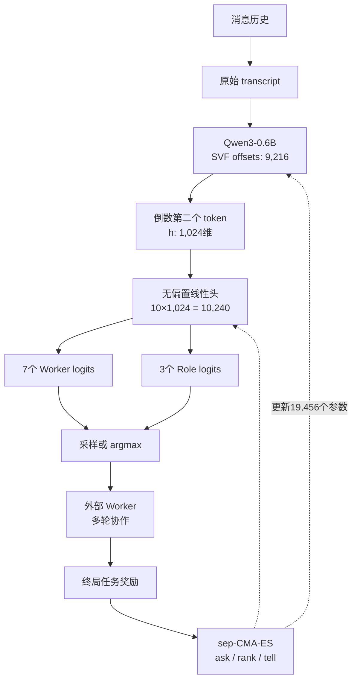

# OpenFugu 路由机制剖析

## 1. sep-CMA-ES 与训练选择

sep-CMA-ES（Separable Covariance Matrix Adaptation Evolution Strategy）是一种无梯度黑盒优化方法。它围绕当前均值参数采样一批候选向量，分别执行任务得到适应度，再按排名更新均值、全局步长及各维搜索尺度。普通 CMA-ES 维护完整的 \(N\times N\) 协方差；当 \(N=19,456\) 时约有 3.78 亿个元素，更新和分解代价过高。sep 版本把协方差限制为对角形式，状态和采样成本近似随参数量线性增长，但代价是不能显式学习参数间的相关方向。

OpenFugu 优化的是端到端轨迹奖励：路由器先作离散的 Worker/Role 选择，再调用外部黑盒 LLM，经过多轮交互后才得到成功/失败、轮数或成本等终局信号。外部 API、`argmax`、程序判题均切断普通反向传播路径；稀疏二值奖励若用策略梯度也会产生较大的方差和信用分配困难。sep-CMA-ES 只要求“参数向量→最终得分”，因此能够直接优化这类非光滑目标。需要强调：路由头本身可微；如果存在逐样本正确路由标签，交叉熵梯度下降通常更省样本。选择进化策略针对的是黑盒端到端目标，而非参数天生不可导。

## 2. 参数、输入与输出

题目所称“约 19,500”精确为 **19,456**。其中 9,216 个是 9 组 SVF offset（每组 1,024）：`embed_tokens`、第 26 层的 q/k/v/o、gate/up/down 投影以及 `lm_head`。SVF 将权重写成 \(W=U\Sigma V^T\)，冻结 \(U,V\)，仅调整已有奇异方向的强弱。另 10,240 个构成无偏置线性头 \((7+3)\times1024\)。输入不是生成文本，而是把历史消息拼成 `role: content` 原始 transcript 后，由 Qwen3-0.6B 产生的倒数第二个 token 隐状态。输出为 10 个 logits：前 7 个选择模型槽位，后 3 个独立选择 Worker、Thinker、Verifier；训练可按 softmax 采样，评估取 argmax。

## 3. 95% 与 100% 测量什么

自测 fixture 共 37 条，每条包含期望 `agent_id` 和 `role_id`。模型选择准确率为
\(\sum I(\hat a_i=a_i)/37\)，发布结果 35/37≈95%；角色准确率为
\(\sum I(\hat r_i=r_i)/37\)，结果 37/37=100%。两者分别比较两个独立 logits 分块的 argmax，不是回答正确率，也不代表真实任务上的编排收益。该测试验证输入格式、实现和 checkpoint 的一致性；改用 chat template、tokenizer 或 transcript 格式会改变隐藏状态分布。

## 4. 递归训练为何 TIE

真实递归评测中 round-0 均值约 0.617，round-1 约 0.616；40 个样本中改进 0 个、退化 1 个，结论为 TIE。原因包括：首轮已接近当前模型和奖励上限；同一模型重复修订没有新增证据，错误相关性高；统一追加复核会扰动正确答案；样本量和奖励粒度不足以识别微小变化；终局奖励难以分配修订收益。改进方向是仅对低置信度或验证失败样本触发递归，引入异构 critic/verifier、证据化错误清单和步骤级奖励，并使用配对测试报告质量、显著性、延迟和成本。

## 参考

- [OpenFugu README](https://github.com/trotsky1997/OpenFugu)
- [HOW_FUGU_IS_IMPLEMENTED.md](https://github.com/trotsky1997/OpenFugu/blob/main/docs/HOW_FUGU_IS_IMPLEMENTED.md)
- [train_trinity.py](https://github.com/trotsky1997/OpenFugu/blob/main/train/train_trinity.py)
