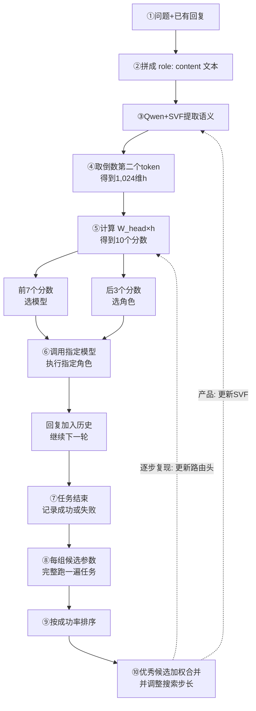

# OpenFugu 路由机制剖析

OpenFugu 路由器不回答问题，只决定**下一个模型及其角色**。

## 1. sep-CMA-ES 是什么？为什么不用梯度下降？

sep-CMA-ES 是一种**无梯度进化策略**，类似“试配方”：生成候选、跑任务评分，再向高分候选靠近。

CMA-ES 学习参数联动，但 19,456 维矩阵约 3.78 亿个元素。`sep` 只保留各参数的搜索尺度，复杂度降为线性级，但难以学习相关方向。

路由头本身可求导，但 `argmax`、外部模型和判题切断端到端反向传播；0/1 终局奖励也难以归因。策略梯度虽可用，但方差大、rollout 贵。sep-CMA-ES 只需“参数→任务→得分”，能直接优化最终成功率。

产品 Fugu 先监督预热，再用 sep-CMA-ES 优化终局奖励；OpenFugu 逐步实验冻结 SVF，只进化路由头。0.750→1.000 仅来自 8 道题，只证明机制跑通。

## 2. 19,500 个参数在哪里？输入输出是什么？

精确为 **19,456**：

| 部分 | 数量 | 位置与作用 |
|---|---:|---|
| SVF offset | 9,216 | 9组×1,024，位于词嵌入、第26层的 q/k/v/o、gate/up/down 投影及 lm_head；只调已有奇异方向的强弱 |
| 线性路由头 | 10,240 | 无偏置矩阵，形状为 10×1,024 |

输入是消息历史拼成的 `role: content` 文本。Qwen3-0.6B 处理后，程序取**倒数第二个 token 的 1,024 维隐藏状态**，不使用生成文本。

路由头输出 10 个 logits（可理解为候选分数），但不是“十选一”：

- 前 7 个分别给 7 个模型槽位打分；
- 后 3 个分别给 `Worker`、`Thinker`、`Verifier` 打分。

两组各自取最大值，得到 `(agent_id, role_id)`，即“选哪个模型、担任什么角色”。

## 3. 角色 100%、模型选择 95% 测什么？

37 条测试样例各自带有参考 `agent_id` 和 `role_id`。评估关闭随机采样，对两组 logits 分别取 `argmax`：

- 模型选择准确率：`35/37≈95%`，表示模型槽位与参考一致；
- 角色分配准确率：`37/37=100%`，表示角色与参考一致。

两项独立计算，可能“模型错、角色对”。它们衡量 checkpoint 路由行为的**复现程度**，用于验证参数切分和推理；不是答题正确率，也不表示所选模型有 95% 概率答对。

## 4. 递归训练为什么 TIE？

sep-CMA-ES 训练 TRINITY 路由头；递归实验则用 GRPO 训练 3B Conductor，让它看到第0轮计划后生成第1轮修订。

留出集上，第0轮得分 0.617，第1轮 0.616；40题中改善0题、退化1题，因此判为 TIE。主要原因是：

1. ToolScale-easy 较简单，首轮已经很强，剩余提升空间小；
2. GRPO 每组8个样本得分几乎相同，`reward_std≈0`，优势值接近零，训练信号消失；
3. 第二轮只有自己的旧答案和通用“请修改”指令，没有工具执行结果、独立批评者或新证据；
4. 评估采用贪心解码，同一模型容易重复原方案，重写还可能破坏原本正确的答案。

因此结论不是“递归无效”，而是：**链路已跑通，但在当前强模型和简单任务上，没有证据表明第二轮有收益。**
