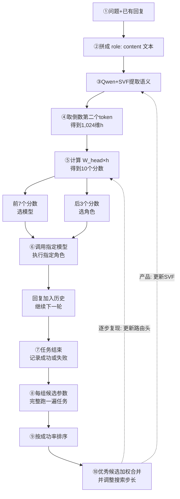

# OpenFugu 路由机制剖析

OpenFugu 路由器不回答问题，只决定**下一个模型及其角色**。

## 1. sep-CMA-ES 是什么？为什么不用梯度下降？

sep-CMA-ES 是不依赖梯度的黑盒进化优化方法。每一代围绕当前参数生成多组候选解，让每组候选完整执行任务并计算最终奖励，再向高奖励方向更新参数和搜索步长。`sep` 只维护每个参数的独立搜索尺度，不维护完整协方差矩阵，因此适合高维参数搜索，但不能建模参数之间的相关方向。

OpenFugu 的路由结果经过 `argmax` 选择模型和角色，之后还要调用外部模型并由任务判定器给出终局奖励，无法形成稳定的端到端可微损失。路由头即使局部可求导，也无法把外部模型的最终成败可靠地反向传播回来；0/1 终局奖励还存在 credit assignment 问题。sep-CMA-ES 只需要“参数—完整任务—最终得分”，可以直接优化系统目标，所以适合这个路由场景。

## 2. 19,500 个参数在哪里？输入特征是什么？输出格式是什么？

代码中的精确数量是 **19,456**，与文档中的约 19,500 个一致：

| 部分 | 数量 | 位置与作用 |
|---|---:|---|
| SVF offset | 9,216 | 9 组×1,024，作用于词嵌入、第 26 层的 q/k/v/o、gate/up/down 投影和 lm_head，只调整已有奇异方向的强弱 |
| 线性路由头 | 10,240 | 无偏置矩阵，形状为 10×1,024，将隐藏状态映射为 10 个路由分数 |

输入是消息历史拼成的 `role: content` 文本。Qwen3-0.6B 编码后，程序取倒数第二个 token 的 1,024 维隐藏状态，不使用模型生成的回答文本。

路由头输出 10 个 logits，但不是 10 个类别中只选一个：

- 前 7 个分数对应 7 个模型槽位；
- 后 3 个分数对应 `Worker`、`Thinker`、`Verifier` 三种角色；
- 两组分别取最大值，输出 `(agent_id, role_id)`，即“哪个模型执行、以什么角色执行”。

## 3. “角色分配准确率 100%、模型选择准确率 95%”测什么？

37 条测试样例分别提供参考 `agent_id` 和 `role_id`。评估时关闭随机采样，对模型分数和角色分数分别取 `argmax`，再与参考标签逐条比较：

- 模型选择准确率为 `35/37≈95%`，表示选中的模型槽位与参考模型一致的比例；
- 角色分配准确率为 `37/37=100%`，表示选中的角色与参考角色一致的比例。

两项指标独立计算，因此可能出现模型选错但角色选对。它们衡量的是路由 checkpoint 对参考路由行为的复现程度，不是最终回答正确率，也不表示模型有 95% 的概率回答正确。

## 4. 递归训练为什么是 TIE？

递归实验用 GRPO 训练 3B Conductor，让模型根据第 0 轮计划生成第 1 轮修订，再比较两轮任务得分。留出集上第 0 轮得分为 0.617，第 1 轮为 0.616；40 道题中改善 0 道、退化 1 道，因此结果判为 TIE。

原因主要有四点：

1. ToolScale-easy 任务较简单，第 0 轮已经取得较高分，剩余提升空间很小；
2. 每组 8 个 GRPO 样本的奖励几乎相同，`reward_std≈0`，优势值接近零，更新信号不足；
3. 第 1 轮只看到旧计划和通用修改指令，没有工具结果、独立批评或新证据；
4. 评估采用贪心解码，模型容易重复原方案，盲目重写还可能破坏原本正确的内容。

因此，实验只能说明递归训练链路已跑通；在当前模型、任务和反馈信号下，没有证据证明第二轮能够稳定带来收益。
