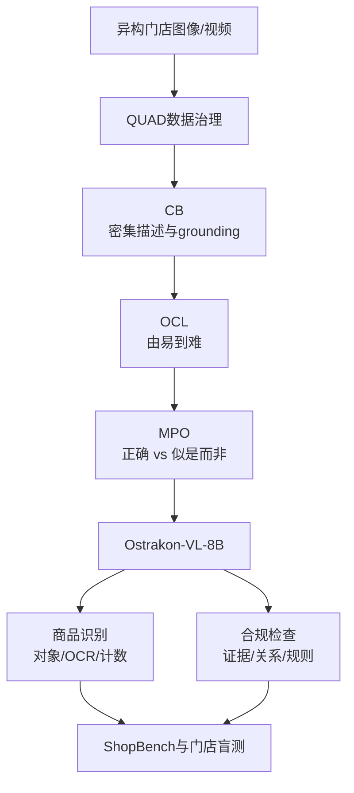

# Ostrakon-VL-8B 微调路径分析

## 1. 数据来源、标注方式与领域增益

**公开事实。** Ostrakon-VL-8B 基于 Qwen3-VL-8B-Instruct，面向餐饮与零售门店（FSRS）；ShopBench 覆盖 ShopFront、ShopInterior、Kitchen，以及单图、多图和视频。官方披露 QUAD 数据治理和 CB→OCL→MPO 三阶段训练：密集 caption 注入领域知识，离线课程学习按难度训练，混合偏好优化区分正确回答与“看似合理但细节错误”的回答。8B 模型在 ShopBench 为 60.1，同基座为 55.3；但 benchmark 因法律原因延期公开，完整结果尚难独立复核。

**合理推测。** 原始数据很可能来自不同门店、摄像头/手机和拍摄角度的店外、店内、货架、厨房图片与视频，再混入多图对照。监督形式应包括密集区域描述、OCR/属性/计数/空间关系 QA，以及带规则结论的合规问答；初始标签可能由强 MLLM 批量生成，再经奖励模型、无图对照、基座参考过滤、多模态去重、能力重采样和人工抽检。高风险合规样本还应标注证据区域、规则版本和 `pass/fail/unclear`，而非只有一句自然语言答案。

领域增益主要不是参数增加，而是训练分布与监督目标对齐：模型反复看到拥挤、遮挡、小字、相似 SKU、货架空位、通道障碍等长尾模式；视觉必要性过滤减少“看常识猜答案”；困难负例和偏好对惩罚漏数、错字及似是而非的解释；课程学习先建立对象/OCR grounding，再学习多图、视频和规则推理。这与官方报告相对同基座提升 4.8 分相符，但不能据此推断所有真实门店都提升同样幅度。

## 2. 合规检查与商品识别的异同

二者共享 Qwen3-VL 的视觉编码、视觉—文本融合、对象/OCR grounding、属性与空间关系建模。商品识别主要回答“是什么、多少、在哪里”，依赖细粒度类别、包装文字、计数和商品库映射。合规检查则是组合任务：先识别消防出口、障碍物、价签及商品，再判断“障碍物是否侵入通道”“价签是否与陈列对应”，最后将可见证据映射到地区/品牌规则。它因此更依赖关系推理、可更新规则、证据引用、阈值和拒答机制。模型参数适合提取事实，最终合规裁决不应完全固化在模型记忆中；高风险场景应由规则引擎或检索到的规则执行，并保留人工复核。

## 3. 下一版迭代方案

**训练数据：** 增加不同地区、季节、品牌、摄像设备、低照度和遮挡切片；采集真实误报/漏报、合规—违规配对和临界反例；补充框/区域、OCR、计数、规则版本、证据与不确定性标注；按门店和时间隔离数据，防止近重复泄漏，并对敏感信息脱敏、对高风险标签双人复核。

**任务设计：** 采用“定位证据→提取事实→检索规则→结构化裁决”多任务训练；加入反事实问答、多图一致性、视频状态变化、SKU 检索和主动拒答；对消防等高风险任务让两个模型独立判断，冲突时输出 `unclear`，而不是强制生成结论。

**评估指标：** 除总分外，按场景/设备/风险等级报告 macro-F1；对象定位用 IoU/mAP，OCR 用 CER，计数用 MAE；合规任务重点报告高风险召回率、漏报率和证据正确率；同时评估校准误差、选择性风险、无图对照 VNR/VIF、分布外鲁棒性、延迟和显存。独立门店盲测及规则版本回放应成为发布门槛。

## 参考

- [Ostrakon-VL-8B Model Card](https://huggingface.co/Ostrakon/Ostrakon-VL-8B)
- [Ostrakon-VL 论文](https://arxiv.org/abs/2601.21342)
