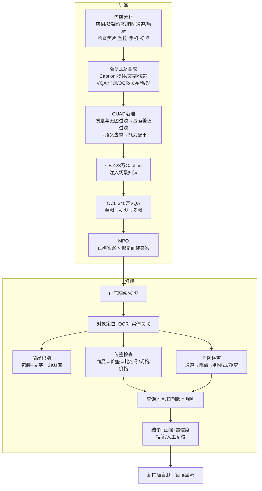

# Ostrakon-VL：微调机制与迭代分析

## 1. 数据来源、标注与领域增益

数据来自监管检查、低清监控和手机拍摄，覆盖店面、店内、后厨及三种输入格式。强 MLLM 先生成描述和问答，QUAD 再四步筛选：①奖励模型检查图文一致性，删除“不看图也能答”的题；②与基座答案比较，保留尚未掌握且标签更好的样本；③删除图像/语义近重复；④提高 OCR、定位、空间关系等稀缺能力的比例。VQA 从 6925 万条压到 340 万条，Caption 从 2571 万条压到 423 万条；约 7000 条众包精标数据训练能力分类器。

具体采集机构和逐条标注方式未公开。合理推测是“模型生成—自动过滤—人工抽检”，消防、价签等高风险标签由业务人员复核。增益来自分布对齐：通用模型较少见反光价签、低清小字、遮挡、相似包装和密集陈列。CB 建立门店概念，OCL 缓解领域迁移，MPO 压制“文字、数量或关系有误却貌似合理”的回答。ShopBench 从 55.3 升至 60.1，但不能外推到所有门店。

## 2. 合规检查与商品识别

两者共享视觉编码、OCR、定位、计数和实体关联。商品识别完成“包装/文字→SKU”；合规检查继续做关系判断和规则匹配。价签任务先绑定商品与价签，再比较名称、规格、价格；消防任务定位通道和障碍物，再判断侵占或净空不足。因此合规额外依赖空间推理、证据定位、规则版本和置信度校准。规则宜放在外部规则库；证据不足时拒答并转人工。

## 3. 下一版迭代

**训练数据：** 补低照度、反光、遮挡、相似 SKU、临界违规及线上错误；标注证据框、OCR 原文、商品—价签绑定、规则版本和“不确定”。按门店/时间隔离数据，防止近似画面泄漏。

**任务设计：** 固定输出“定位证据→抽取事实→关联实体→检索规则→结构化裁决”，加入多图一致性、视频状态变化、反事实问题、SKU 检索和主动拒答。

**评估指标：** 商品侧报告 mAP、OCR 字符错误率、计数误差和 SKU 准确率；合规侧报告违规召回率、漏报/误报率、证据/规则正确率及校准误差。用新门店盲测，并按设备、场景、风险等级分层。
