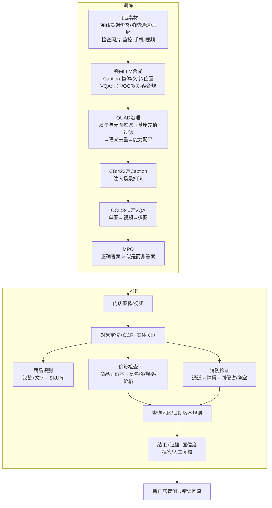

# Ostrakon-VL：微调机制与迭代分析

## 1. 训练数据来源、标注方式与领域增益

公开信息没有披露每条数据的采集机构和人工标注流程。结合文章描述，较合理的训练路径是：采集监管检查、低清监控、手机拍摄和视频帧，覆盖店面、货架、价签、后厨、消防通道等场景；再由强 MLLM 生成 Caption 和 VQA 初标，人工抽检或复核高风险样本。

数据治理可以由 QUAD 四步完成：先过滤图文不一致和不看图也能回答的样本；再与基座模型能力比较，保留能补充领域能力的样本；删除图像和语义近重复；最后提高 OCR、定位、计数、空间关系和合规判断等稀缺能力的比例。公开数字显示，VQA 从 6925 万条筛到 340 万条，Caption 从 2571 万条筛到 423 万条，并使用约 7000 条众包精标数据训练能力分类器。

领域微调的增益来自训练分布与零售真实分布对齐。通用 VLM 对反光价签、低清小字、遮挡、相似包装、密集陈列和店内规则通常覆盖不足；Caption Bootstrapping 补充零售实体和场景概念，Offline Curriculum Learning 逐步增加单图、视频和多图难度，Mixed Preference Optimization 抑制“看似合理但文字、数量、位置关系错误”的回答。ShopBench 分数从 55.3 提升到 60.1，但该结果不能直接外推到所有门店。

## 2. 合规检查与商品识别的技术关系

两类能力共享视觉编码、OCR、目标定位、计数和实体关联等底层能力。商品识别的主链路是“包装和文字特征 → 商品类别或 SKU”；合规检查在此基础上增加“实体之间的空间关系 → 外部规则匹配 → 合规裁决”。

价格标签检查需要先定位商品和价签，再建立商品—价签对应关系，比较名称、规格和价格；消防通道检查需要定位通道、障碍物和净空区域，再判断是否侵占通道。因而合规检查比单纯商品识别更依赖空间关系推理、证据框定位、规则版本管理和置信度校准。模型负责视觉事实抽取，法规和门店标准应放在可更新的外部规则库中；证据不足时必须拒答或转人工复核。

## 3. 下一版迭代方案

### 训练数据

- 增加低照度、反光、遮挡、相似 SKU、密集陈列、临界违规和线上真实错误样本。
- 为每条样本标注证据框、OCR 原文、商品—价签绑定、规则版本、严重等级和“不确定”状态。
- 按门店、时间和摄像设备隔离训练集与测试集，避免同一门店近似画面泄漏。
- 对漏报和高风险误报提高采样权重，并保留人工审核记录用于回放训练。

### 任务设计

- 统一输出“定位证据 → 抽取事实 → 关联实体 → 检索规则 → 结构化裁决”。
- 增加多图一致性、视频状态变化、反事实问题、SKU 检索、规则版本切换和主动拒答任务。
- 将商品识别、价签核验、消防检查拆成可单独验收的子任务，再增加综合巡检任务检验组合能力。

### 评估指标

- 商品识别：目标定位 mAP、OCR 字符错误率、计数误差、SKU 准确率和商品—价签关联准确率。
- 合规检查：违规召回率、漏报率、误报率、证据框准确率、规则引用准确率和置信度校准误差。
- 工程指标：单图和多图延迟、显存占用、拒答准确率及人工复核率。
- 使用未见门店盲测，并按光照、设备、场景、风险等级和商品密度分层报告结果。
