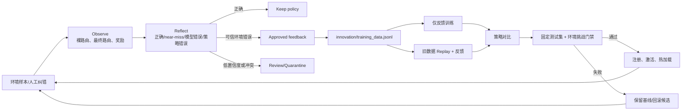

# Task 4 选项 A：环境反馈驱动的数据飞轮

## 1. 设计目标

基础版本只能接收人工给出的正确 Worker，再定期做一次增量训练。本版本把它升级为可执行的自改进闭环：路由器在环境中作出动作，环境返回金标或已验证奖励，ReAct 控制器据此观察、反思并选择动作，自动生成训练样本、训练候选模型、执行回归门禁，最后发布或回滚。

这里的“模型自己训练自己”不等于允许模型给自己生成标签。待训练路由器可以发现自身错误，但监督目标必须来自人工纠错、环境金标或独立验证器；模型自评只能进入人工审核队列。这个边界用于防止确认偏误不断放大。

## 2. 从 CogDoc 复用的反馈原则

本实现参考了 CogDoc 的四个工程机制：

1. `FeedbackStore` 先保存原始反馈，差评另形成可进入评测的数据记录，而不是直接修改线上模型。
2. `feedback_understanding` 将反馈解析为类型、目标、置信度、建议动作和 `needs_review`，因此本项目也把反馈决策拆成结构化 Observation、Reflection 和 Action。
3. 检索调权记录可以 enable/disable，说明自动改进必须可撤销；本项目对应为候选注册、门禁激活和按父版本回滚。
4. 评测门禁同时检查绝对指标和相对基线。本项目检查固定测试集 macro-F1、每类 recall 及环境挑战收益。

CogDoc 本身使用 LangGraph 条件边组织 Agent 流程，并非完整的经典 ReAct 文本代理。本项目借用 ReAct 的控制思想，将其实现成确定性的 `Observe → Reflect → Act → Observe` 状态循环，避免依赖外部 LLM 才能复现。

## 3. 闭环架构



## 4. ReAct 状态与动作

`react_flywheel.py` 同时观察裸模型动作 `raw_worker` 和门控后的 `worker`：

| 环境状态 | 奖励 | Reflection | Action |
|---|---:|---|---|
| 裸模型与最终策略都正确 | `1.0` | 无需制造自训练样本 | `keep_policy` |
| 裸模型错误、门控救回 | `0.25` | near-miss，模型仍依赖规则兜底 | `approve_training_signal` |
| 裸模型和最终策略都错误 | `-1.0` | 环境确认路由错误 | `approve_training_signal` |
| 裸模型正确、门控改错 | `-1.0` | 训练权重不能修复规则错误 | `queue_policy_review` |
| 来源为固定 test | 不写回 | 防止评测集污染 | `protect_fixed_test` |
| 低置信度或非可信自评 | 不直训 | 需要人工验证 | `queue_feedback_review` |

Trace 只保存可审核的策略摘要和动作，不保存或伪造模型隐藏思维链。完整参考运行见 `react_trace.jsonl`。

## 5. 反馈质量与防污染

`feedback_store.py` 实现以下约束：

- 精确重复反馈按 `image + query + correct_worker` 去重。
- 同一 `image + query` 出现不同正确 Worker 时，相关记录全部转为 `quarantined_conflict`。
- 只有 `environment_gold` 或 `verified_evaluator` 且置信度不低于 0.9 的记录可以自动批准。
- 人工反馈默认 `pending_review`，必须通过 `set_status(..., reviewer=...)` 留下审核身份。
- 固定测试集反馈直接拒绝。
- 只有 `approved` 记录会物化到 `innovation/training_data.jsonl` 并进入训练。
- JSONL 和模型注册表只保存相对于各自产物目录的路径；运行时再解析为当前机器的绝对路径，clone 到其他目录后仍可复现。
- 主路由数据 `router/training_data.jsonl` 保持不可变；训练时在内存中做 replay 合并，避免破坏原切分和数据 hash。

## 6. 自训练与发布门禁

`IncrementalTrainer` 自动训练并比较两种策略：

- `feedback_only`：只用本轮纠错样本，作为灾难性遗忘对照。
- `replay_plus_feedback`：60 条旧训练数据 replay，并混入已批准反馈；它是唯一可发布候选。

候选需同时满足：

1. 固定 15 条测试集上，raw 与 gated macro-F1 均不得下降超过 0.01。
2. 固定测试集上任一 Worker recall 不得下降超过 0.05。
3. 环境挑战集 gated accuracy 不得下降超过 0.01。
4. 环境挑战集 raw 或 gated accuracy 至少一项严格提升。

通过后保存 checkpoint、注册父版本、激活并热加载；失败候选只登记实验，不覆盖当前模型。`ModelRegistry.rollback()` 可将线上版本恢复到父版本，并记录操作者原因和时间。

## 7. 文件与运行

| 文件 | 作用 |
|---|---|
| `react_flywheel.py` | ReAct 环境循环与生命周期动作 |
| `feedback_store.py` | 校验、去重、冲突隔离、审核和样本物化 |
| `incremental_trainer.py` | 双策略训练、量化对比和回归门禁 |
| `model_registry.py` | 父子版本、激活与回滚 |
| `run_feedback_experiment.py` | 可复现参考实验入口 |
| `training_data.jsonl` | 自动生成的已批准增量样本 |
| `react_trace.jsonl` | Observation/Reflection/Action 审计轨迹 |

```bash
make feedback
```

`make feedback` 带 `--reset-demo-state`，只用于重建仓库内演示产物；生产运行应省略该参数并使用独立持久化目录。

## 8. 局限性与下一步

- 当前环境信号来自 12 条人工构造的 hard-negative 金标，不是线上真实门店 KPI。
- 两条反馈样本仍太少，收益可能受 seed 与 CMA-ES 搜索代数影响；30 代候选曾被门禁拒绝，90 代才通过。
- 环境挑战包含本轮被纠错样本，因此其提升代表“修复已知错误”，不能独立证明未知分布泛化；泛化证据主要来自未写回的固定测试集。
- 当前 Reflection 是可复现的确定性策略。未来可接入 VLM evaluator 分析 Worker 证据，但其输出必须先做一致性校验，不能直接成为金标。
- 生产阈值应从演示值 2 提升到至少 20–50，并加入时间窗口、门店分层抽样、标注者一致性和在线 canary 监控。
